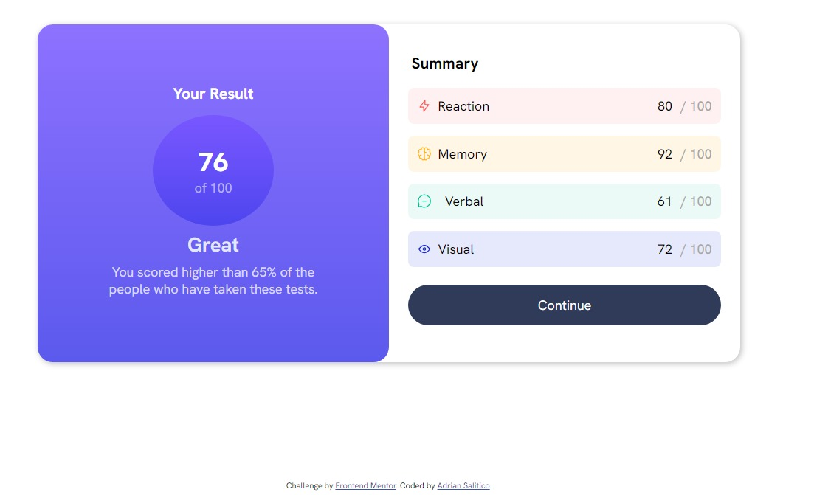
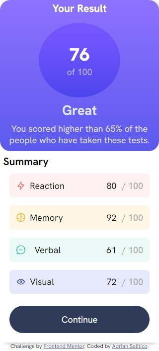

# Frontend Mentor - Results summary component solution

This is a solution to the [Results summary component challenge on Frontend Mentor](https://www.frontendmentor.io/challenges/results-summary-component-CE_K6s0maV). Frontend Mentor challenges help you improve your coding skills by building realistic projects.

## Table of contents

- [Overview](#overview)
  - [The challenge](#the-challenge)
  - [Screenshot](#screenshot)
  - [Links](#links)
- [My process](#my-process)
  - [Built with](#built-with)
  - [What I learned](#what-i-learned)
  - [Continued development](#continued-development)
  - [Useful resources](#useful-resources)
- [Author](#author)
- [Acknowledgments](#acknowledgments)

**Note: Delete this note and update the table of contents based on what sections you keep.**

## Overview

### The challenge

Users should be able to:

- View the optimal layout for the interface depending on their device's screen size
- See hover and focus states for all interactive elements on the page
- **Bonus**: Use the local JSON data to dynamically populate the content

### Screenshot

#### Desktop Version



#### Mobile Version



### Links

- Solution URL: [Add solution URL here](https://github.com/Frogerall/results-summary-component)
- Live Site URL: [Add live site URL here](https://frogerall.github.io/results-summary-component/)

## My process

### Built with

- Semantic HTML5 markup
- CSS custom properties
- Flexbox
- Mobile-first workflow
- Saas/Scss

### What I learned

In this activity, I utilized and applied my knowledge of flexbox, the box model, and linear gradient backgrounds. This experience greatly assisted me in reinforcing and solidifying my skills.

<h1>Some Custom CSS I'm proud of</h1>

```css
:root {
 --primary-font: "Hanken Grotesk", sans-serif;
 --light-red: hsl(0, 100%, 67%);
 --orange-yellow: hsl(39, 100%, 56%);
 --grean-teal: hsl(166, 100%, 37%);
 --cobalt-blue: hsl(234, 85%, 45%);
 --primary-bg: hsl(252, 100%, 67%);
 --secondary-bg: hsl(241, 81%, 54%);
 --neutral-white: hsl(0, 0%, 100%);
 --pale-blue: hsl(221, 100%, 96%);
 --lavender: hsl(241, 100%, 89%);
 --dark-blue: hsl(224, 30%, 27%);
}
```

### Continued development

- Make it Responsive on all Device.
- Make it easy to be integrate on any existing website.
- Make the CSS clean and easy to read.

### Useful resources

- [FlexboxFroggy](https://Flexboxfroggy.com) - I really liked this website.. it helps me a lot on using flexbox.

## Author

- Website - [Adrian Salitico](http://salproj.tech)
- Frontend Mentor - [@yourusername](https://www.frontendmentor.io/profile/frogerall)
- Twitter - [@yourusername](https://www.twitter.com/saliticoadrian)

## Acknowledgments

I would like to Thank the Front-end Community for giving tons of Free Challenges that really help us Web Developers!.
